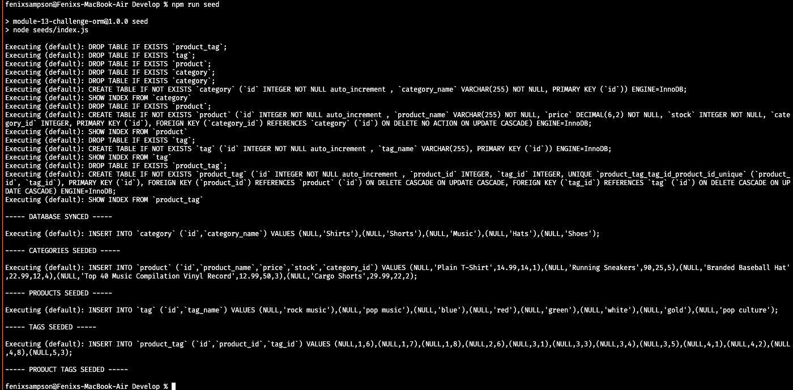
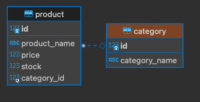
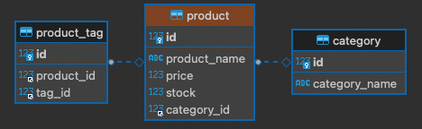
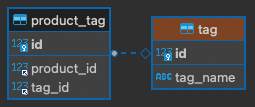
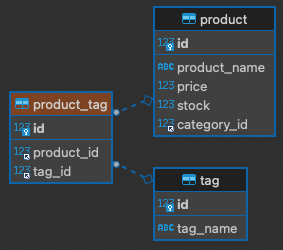

# E-Commerce Back End

  

  ## Description

  Build back end for an e-commerce site by modifiying exisiting starter code.
  
  Click the link below to visit my deployed page.

  https://youtu.be/6rdc226lT4k
  <!-- [URL](undefined) -->

  ## Table of Contents
  
  * [Goals](#goals)

  * [Usage](#usage) 

  * [Installation](#installation)  

  * [Test](#test)

  * [Problems](#problems)

  * [Visualization](#visualization)

  * [Acknowledgements](#acknowledgements)

  * [Contributions](#contributions)

  * [Resources](#resources)

  * [License](#license) 

  * [Contact](#contact) 

  
  ## Goals

  Connect back end to a working front end.

  ## Motivation

  E-commerce is the largest sector of the electronics industy. This project allows a company to organize and sort their products.

  ## Usage

  Use Get, Post, Put and Delete routes to connect back end to the front end of a working e-commerce site

  ## Installation
  
  npm -i    then update .env file     then npm run seed     then npm start  

  ## Test

  N/A

  ## Problems

  Getting the Put and Post routes to work properly is what gave me the most issues but besides that this project went well for the most part.

  ## Visualization

  Screenshot showing npm start 

  

  Screenshot showing npm run seed

  

  The following images show interconnectivity between tables in database

  

  

  

  

  ## Acknowledgements

  Fenix Sampson, Brent Graves, Gabriel Cavalcante Causin

  ## Contributions

  Email me or submit a pull request

  ## Resources
 
  Express.js, MySQL, JSON, Sequelize and Insomnia

  ## License

  

  This projet uses MIT. 
  
  The link to the License can be found here (https://opensource.org/licenses/MIT)

  ## Contact
  
  GitHub Username: FenixS83 [@FenixS83](https://github.com/FenixS83)

  fenix.sampson@gmail.com

